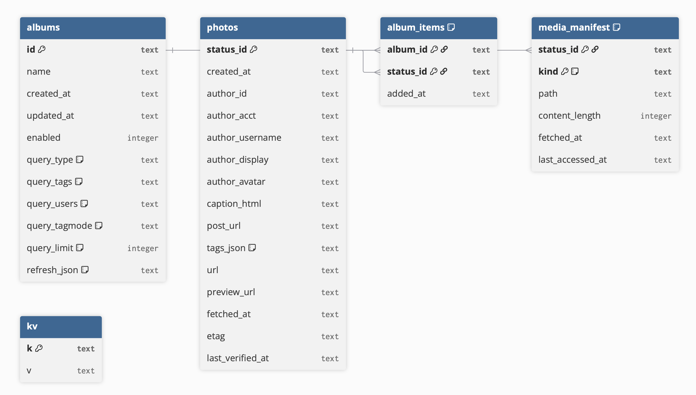

# PixelFree Virtual Albums – Thoughts on Design

This document captures ideas about **Virtual Albums**, starting from the design of the frontend/backend HTTP API, through the internal backend repository interfaces, and other suggested structure.


## 1. Public HTTP API (Frontend ⇄ Backend)

All endpoints are under `/api/albums` and require an authenticated session (OAuth).  
Responses use `application/json`. Errors use the standardized shape:

```json
{ "error": { "code": "BadRequest", "message": "…" } }
```

### 1.1 Create album
**POST** `/api/albums`

Create a new virtual album from a query definition.

**Request**

```json
{
  "name": "Retro Macs",
  "query": {
    "type": "tag" | "user" | "compound",
    "tags": ["retrocomputing","classicmac"],
    "users": { "accts": ["@bits@mastodon.social"] },
    "tagMode": "any" | "all",
    "limit": 40
  },
  "refresh": { "intervalMs": 600000 }
}
```

**Response (201)**

```json
{
  "id": "alb_01HQ0…",
  "name": "Retro Macs",
  "query": { "type":"tag","tags":["retrocomputing","classicmac"],"tagMode":"all","limit":40 },
  "refresh": { "intervalMs": 600000, "last_checked_at": null, "backoff_until": null,
               "since_id": null, "max_id": null },
  "stats": { "total": 0 },
  "enabled": true,
  "created_at": "2025-08-29T02:15:20Z",
  "updated_at": "2025-08-29T02:15:20Z"
}
```


### 1.2 Get album by id
**GET** `/api/albums/:id`

**Response (200)**

```json
{
  "id": "alb_01HQ0…",
  "name": "Retro Macs",
  "query": { "type":"tag","tags":["retrocomputing","classicmac"],"tagMode":"all","limit":40 },
  "refresh": { "intervalMs": 600000, "last_checked_at": "2025-08-29T02:30:02Z", "since_id": "8569…" },
  "stats": { "total": 128, "last_added": "2025-08-29T02:28:30Z" },
  "enabled": true,
  "created_at": "2025-08-29T02:15:20Z",
  "updated_at": "2025-08-29T02:30:02Z"
}
```


### 1.3 List albums
**GET** `/api/albums?offset=0&limit=20&enabled=true`

**Response (200)**

```json
{
  "items": [ { "id":"alb_…", "name":"Retro Macs", "query":{…}, "stats":{ "total":128 } } ],
  "total": 3,
  "offset": 0,
  "limit": 20
}
```

### 1.4 Update album
**PATCH** `/api/albums/:id`

Supports updates to name, query, or refresh policy.


### 1.5 Enable/disable album
**POST** `/api/albums/:id/toggle`


### 1.6 Delete album
**DELETE** `/api/albums/:id`


### 1.7 Manual refresh
**POST** `/api/albums/:id/refresh`


### 1.8 Get photos in an album
**GET** `/api/albums/:id/photos?offset=0&limit=20`


## 2. Internal Backend Interfaces

These are abstractions for repositories and services used internally.

### 2.1 Album Repository
- `create(album)`
- `get(id)`
- `list({ offset, limit, enabled })`
- `update(id, patch)`
- `toggle(id, enabled)`
- `remove(id)`
- `appendItems(albumId, statusIds)`
- `listItems(albumId, { offset, limit })`

### 2.2 Photo Repository
- `upsertMany(photos)`
- `getMany(ids)`
- `listForAlbum(albumId, { offset, limit })`
- `removeUnreferenced()`

### 2.3 Media Cache
- `ensureCached(photo)`
- `touch(statusId)`
- `evict(by)`

### 2.4 Accounts Service
- `resolveAccountId(acct)`
- `resolveManyAccts(accts)`

### 2.5 Fetcher / Scheduler
- `refreshAlbum(album)`
- `scheduleTick()`


## 3. Status & Errors

Common HTTP status codes and standardized error shapes.

Common status codes

	•	200 OK normal read/refresh.
	•	201 Created on album creation.
	•	204 No Content on delete.
	•	400 Bad Request invalid query (e.g., unknown tagMode, empty query).
	•	401 Unauthorized not logged in.
	•	404 Not Found album ID doesn’t exist.
	•	409 Conflict conflicting name (if you enforce uniqueness).
	•	429 Too Many Requests rate-limited upstream; include retryAfter.
	•	5xx for unexpected server errors (mapped via your errorMapper).

Error body

```json
{ "error":
  {
    "code": "ValidationError",
    "message": "tags must be non-empty",
    "details": {...}
  }
}
```

## 4. SQLite Schema & Repositories

The PixelFree backend uses an SQLite database to manage virtual albums, photo metadata, media caching, and app-level state. The schema is designed to balance simplicity, performance, and federated content constraints, while allowing for future extension.

**Schema Overview**

- `albums` – stores album metadata, query, and refresh state.
- `photos` – normalized metadata for fetched posts.
- `album_items` – join table linking albums to photos.
- `media_manifest` – manages local cache of media files.
- `kv` – key-value store for app metadata.

### Table: albums

**Purpose**: Defines virtual albums, which represent saved queries configured by the user.

**Key Fields**:

	•	id (PK): Unique identifier for the album.
	•	name: Human-readable label for the album.
	•	type: Query type (tag, user, compound).
	•	tags[]: Normalized list of tags included in the query.
	•	user_ids[]: Resolved account IDs to restrict posts by author.
	•	refresh_interval_ms: How often this album should refresh.
	•	last_checked_at: Timestamp of last successful refresh.
	•	since_id, max_id: Pagination watermarks for incremental fetch.
	•	status_ids[]: List of associated photo IDs (denormalized cache).

**Usage**: Albums define how photos are selected and refreshed. For example: “All photos tagged #retrocomputing from @icm@mastodon.sdf.org, refreshed every 15 minutes.”

### Table: photos

**Purpose**: Stores normalized metadata for individual posts fetched from Pixelfed/Mastodon-compatible APIs.

**Key Fields**:

	•	status_id (PK): Global unique identifier for the post.
	•	author_id, acct: Link to the post author.
	•	created_at: When the post was created.
	•	tags[]: Normalized tags applied to the post.
	•	caption: Raw HTML/Markdown caption text.
	•	post_url: Link to the original post.
	•	url, preview_url: Media URLs provided by the source.

**Usage**: Acts as the canonical store of post metadata. Multiple albums may reference the same photo without duplication.

### Table: album_items

**Purpose**: Join table linking albums ↔ photos, supporting many-to-many relationships.

**Key Fields**

	•	album_id (FK → albums.id).
	•	photo_id (FK → photos.status_id).
	•	added_at: When this photo was added to the album’s set.

**Usage**: Provides efficient queries like “fetch all photos in album X” or “find all albums containing photo Y.”

### Table: media_manifest

**Purpose**: Manages the local cache of media files (downloaded images).

**Key Fields**

	•	status_id (FK → photos.status_id).
	•	local_path: Filesystem location of cached media.
	•	content_length: Size of the file on disk.
	•	fetched_at: Last time this file was retrieved.
	•	expires_at: Optional TTL for cache eviction.

**Usage**: Allows the backend to serve media from local disk for offline use, while respecting quota limits (LRU/TTL eviction).

### Table: kv

**Purpose**: Lightweight key-value store for app-wide metadata.

**Fields**

	•	key: String key.
	•	value: JSON/text payload.

**Usage**: Used for global state such as:

	•	Last schema migration applied.
	•	Global sync watermarks.
	•	Miscellaneous flags not worth creating full tables for.

ER Diagram:


## 5. Frontend Flow

- **Create album** → `POST /api/albums`
- **Refresh** → `POST /api/albums/:id/refresh`
- **Display** → `GET /api/albums/:id/photos`
- **Update settings** → `PATCH /api/albums/:id`
- **Delete** → `DELETE /api/albums/:id`

